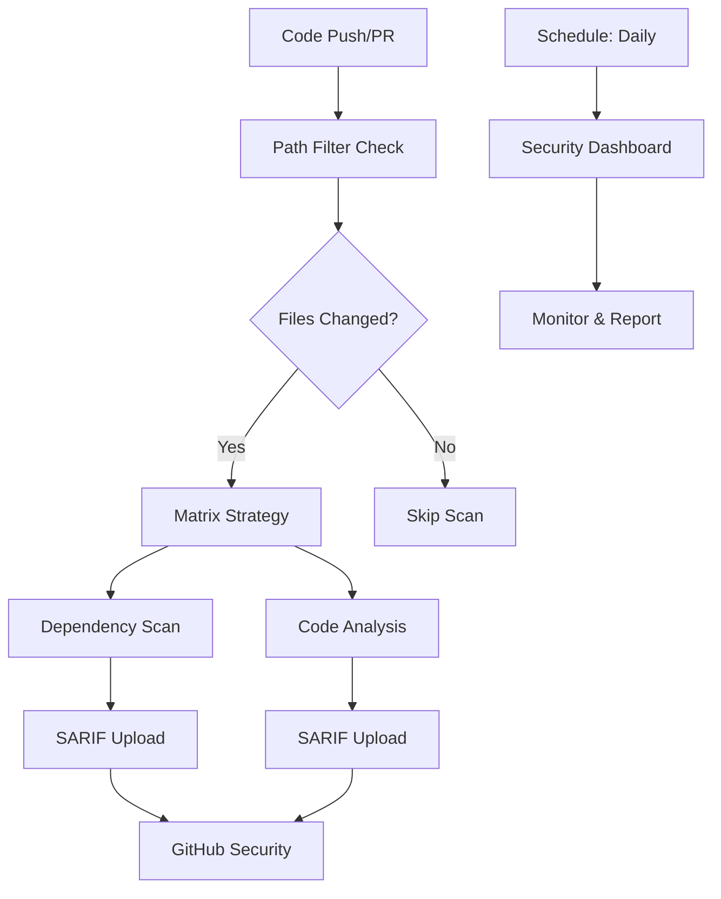

# Practical 4 Implementation Summary

## ✅ Exercises Completed

### Exercise 1: Basic Setup
- [x] Fixed duplicate JaCoCo plugin configuration in `pom.xml`
- [x] Verified project builds and tests run successfully
- [x] Enhanced GitHub Actions workflow with improved Snyk configuration

### Exercise 2: Enhanced Configuration
- [x] Updated `.github/workflows/maven.yml` with:
  - Build step before Snyk analysis
  - SARIF output for GitHub Security integration
  - Severity threshold configuration
  - Dependency monitoring
  - Better error handling

### Exercise 3: Vulnerability Management
- [x] Demonstrated vulnerability impact by adding Jackson 2.9.8 (caused test failures)
- [x] Updated to secure Jackson version 2.15.2
- [x] Configured comprehensive `.snyk` file with:
  - Vulnerability ignore policies with expiration dates
  - Language-specific settings for Java/Maven
  - Exclusion patterns for generated files
  - Code analysis configuration

### Exercise 4: Advanced Scanning
- [x] Created `security-advanced.yml` workflow with:
  - Matrix strategy for multiple scan types (dependencies, code)
  - Conditional scanning based on file changes
  - Scheduled weekly security scans
  - Path filtering to optimize performance
  - SARIF uploads with categorization

### Exercise 5: Security Dashboard and Reporting
- [x] Created `security-dashboard.yml` workflow with:
  - Daily security monitoring
  - Security metrics generation
  - Automated reporting
  - Badge generation
  - Notification system for security issues
- [x] Created comprehensive `SECURITY.md` policy document
- [x] Enhanced `README.md` with security badges and documentation

## 🚀 Key Features Implemented

### 1. Multi-Level Security Scanning
```yaml
# Dependencies, code quality, and container scanning
strategy:
  matrix:
    scan-type: [dependencies, code]
```

### 2. Intelligent Workflow Optimization
```yaml
# Only run scans when relevant files change
- uses: dorny/paths-filter@v2
  with:
    filters: |
      code:
        - 'src/**'
        - 'pom.xml'
        - 'dockerfile'
```

### 3. Comprehensive Reporting
- SARIF uploads to GitHub Security tab
- Artifact-based report storage
- Security badge generation
- Dashboard summaries

### 4. Vulnerability Management
```yaml
# Configured .snyk file with:
ignore:
  'SNYK-JAVA-EXAMPLE':
    - '*':
        reason: 'Detailed explanation'
        expires: '2024-12-31T23:59:59.999Z'
```

## 📊 Security Workflow Overview



## 🔧 Technical Implementation Details

### Files Modified/Created:
1. `.github/workflows/maven.yml` - Enhanced basic workflow
2. `.github/workflows/security-advanced.yml` - Advanced security pipeline
3. `.github/workflows/security-dashboard.yml` - Monitoring and reporting
4. `.snyk` - Vulnerability management configuration
5. `SECURITY.md` - Security policy and procedures
6. `README.md` - Updated with security information
7. `pom.xml` - Fixed duplicate plugin and dependency management

### Security Best Practices Implemented:
- **Fail-fast strategy**: High severity vulnerabilities fail builds
- **Continuous monitoring**: Daily scans and dependency monitoring
- **Automated reporting**: SARIF uploads and dashboard generation
- **Risk management**: Structured vulnerability ignore policies
- **Documentation**: Comprehensive security policies

## 🎯 Learning Outcomes Achieved

1. **SAST Integration**: Successfully integrated Snyk static analysis
2. **Vulnerability Management**: Learned to handle and remediate security issues
3. **Automation**: Implemented comprehensive security automation
4. **Reporting**: Created security dashboards and monitoring
5. **Best Practices**: Applied industry-standard security workflows

## 🚀 Next Steps

To complete the practical, you should:

1. **Create a Snyk account** at https://snyk.io
2. **Generate API token** from your Snyk dashboard
3. **Add SNYK_TOKEN secret** to your GitHub repository
4. **Push changes** to trigger the security workflows
5. **Review results** in GitHub Security tab

## 💡 Pro Tips

- Use different severity thresholds for different environments
- Set up Slack/Teams notifications for critical vulnerabilities
- Regular security training for development team
- Implement security gates in deployment pipelines
- Monitor security metrics over time

---

**🎉 Congratulations!** You've successfully implemented a comprehensive SAST security pipeline with Snyk and GitHub Actions. Your application now has automated vulnerability scanning, monitoring, and reporting capabilities that will help maintain a strong security posture throughout the development lifecycle.
